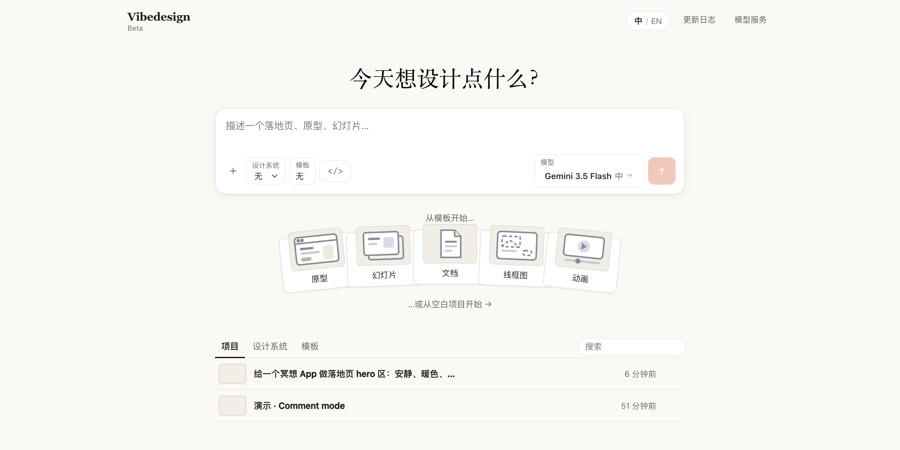

# Vibedesign — Claude Design 的 1:1 本地复刻（BYOK）

[](https://github.com/dandandujie/vibedesign/actions/workflows/release.yml)
[](https://github.com/dandandujie/vibedesign/releases/latest)

**直接下载桌面版**：[Releases](https://github.com/dandandujie/vibedesign/releases/latest) — Windows（`Setup .exe`）/ macOS（`arm64` Apple Silicon、`x64` Intel 的 dmg/zip）。未签名：Windows SmartScreen 选「仍要运行」；macOS 首次打开右键 → 打开（或 `xattr -dr com.apple.quarantine /Applications/Vibedesign.app`）。



目标：使用时**感觉完全在用 Claude Design**——UI/UX/交互/设计逻辑/全流程 1:1，唯一差异是 BYOK（自带模型服务：Anthropic / OpenAI / OpenAI-Responses / Gemini 格式 + 自定义 baseURL），并支持中/英切换。

- 复刻真值来自**实地考察** claude.ai/design（含整套扒下来的 `--om-*` design tokens 与全流程规格）。
- 设计大脑用开源的 [Claude Design 系统提示词 + 14 skills](https://github.com/Trystan-SA/claude-design-system-prompt) 驱动。
- 功能升级参考了开源的 [open-design](https://github.com/nexu-io/open-design) 项目。
- 最终形态：Electron 跨端桌面应用（Win + Mac），当前为本地 web 开发形态。

## 架构

```
Vibedesign/
├─ server/                 Express 薄后端
│  ├─ src/index.ts         SSE 流式聊天 + 配置/项目接口
│  ├─ src/agentApi.ts      Agent API：headless 生成 + artifact 读回（/api/agent/*）
│  ├─ src/mcp.ts           MCP stdio server（coding agent 打通入口）
│  ├─ src/providers/       多格式适配（anthropic / openai / openai-responses / gemini）
│  ├─ src/brain.ts         大脑接线：system-prompt + 34 skills + craft 法则 + 运行时说明
│  ├─ brain/               system-prompt.md + skills/*.md（来自开源仓库）
│  ├─ src/config.ts        模型服务配置（本地 .data/，含 key，不入库）
│  └─ src/storage.ts       项目/artifact 版本持久化
├─ shared/                 server 与 web 共用的 artifact 提取/mddoc 渲染（单一实现）
├─ integrations/           coding agent 集成：/design 技能包 + 一键安装脚本
└─ web/                    Vite + React + TS 工作台
   └─ src/
      ├─ App.tsx           编排：对话流 / 版本 / 精修回路
      ├─ components/       ChatPanel · Canvas · RefinementOverlay · SettingsModal · TopBar
      └─ lib/              artifact 提取 · SSE 客户端 · inspector 桥
```

## 核心操作流程（复刻自原版）

1. **对话生成** — 左侧自然语言描述 → Claude（带 system prompt + skills）产出自包含 artifact
2. **画布渲染** — 右侧沙箱 iframe 实时渲染
3. **精修** — 开「精修」→ 点选画布元素 → 直接改字 / 调间距·颜色·字号 knobs / 写评论让 Claude 改
4. **版本 / 变体** — 每次生成存一个版本，可切换、导出 HTML

## 运行

### 开发（网页）

```bash
npm install                # 装根依赖（concurrently / electron / electron-builder）
npm run install:all        # 装 server + web 依赖
npm run dev                # 同时起后端(8787) + 前端(5473)
```

打开 http://localhost:5473 → 「设置模型」添加模型服务（Base URL / 模型名 / API Key）→ 开始对话。

### 桌面应用（Win + Mac）

```bash
npm run app                # 构建并本机运行 Electron 应用
npm run dist:mac           # 打 Mac 安装包（dmg/zip）→ release/
npm run dist:win           # 打 Windows 安装包（nsis/zip）→ release/
```

桌面版把 Express 服务内嵌进主进程（端口 8788），数据存在系统 userData 目录，与开发环境隔离。

### 在 coding agent 中使用（/design）

对齐原版 Claude Design ↔ Claude Code 的打通方式（MCP server + `/design` 命令），Vibedesign 可以与本地 coding agent 双向工作：在终端里说一句「/design 帮我做个落地页」，agent 驱动 Vibedesign 生成设计并把画布链接交给你；设计定稿后再由 agent 把 HTML 落进代码库。

```bash
npm run build              # 产出 server/dist/mcp.cjs（MCP server）
npm run install:agents     # 一键安装到全部 agent（可带 slug 单个安装，如 npm run install:agents -- kimi）
```

也可以在应用内 **设置 → Agent 打通** 页签里可视化勾选：实时显示各 agent 的 CLI 探测 / MCP 配置 / /design 技能状态，勾选即写入配置、取消勾选即移除（桌面版用应用自身二进制作为 MCP 进程，无需 repo 路径）。

| Agent | 接入方式 |
|---|---|
| Claude Code | MCP server（`vd_design` 等 5 个工具）+ `/design` 技能 |
| Codex CLI | MCP server（`~/.codex/config.toml`）+ 技能 |
| Cursor (CLI/桌面) | MCP server（`~/.cursor/mcp.json`） |
| OpenCode | MCP server（`~/.config/opencode/opencode.json`）+ `/design` 命令 |
| Pi agent | `/design` 技能 + prompts（无原生 MCP，HTTP 直连流程） |
| Hermes | MCP server（`~/.hermes/config.yaml`） |
| Grok Build | MCP server（`~/.grok/config.toml`）+ 技能 |
| Antigravity | MCP server（`~/.gemini/antigravity/mcp_config.json`）+ 技能 |
| Kimi Code CLI | MCP server（`~/.kimi-code/mcp.json`）+ 技能 |
| Qoder CLI | MCP server（`~/.qoder.json`）+ `/design` 命令 |
| Trae | MCP server（IDE `Trae/User/mcp.json`） |

也可单个安装：`npm run install:agents -- kimi`（支持多 slug；全部幂等、写前备份、非法配置拒写）。

工作流：agent 调 `vd_design`（或 `POST /api/agent/design`）→ Vibedesign 用你已配置的 BYOK 模型生成并存版本 → 返回 `editorUrl` 给你在画布上边看边精修 → 需要源码时 agent 用 `vd_get_artifact` 拉回。多页原型传 `skillId: "site-prototype"`。详见 `integrations/design/SKILL.md`。

安全边界：服务只绑定 `127.0.0.1` + Host/Origin 校验，仅本机进程可用，无鉴权——与同机其他本地服务一致。

### 发版（自动）

推一个 `v*` tag，GitHub Actions 会在 macOS/Windows runner 上打包并自动发布 Release：

```bash
npm version patch          # 或手动改 version 后 git tag v0.x.y
git push origin main --tags
```

产物：mac dmg/zip（arm64 + x64）+ Windows nsis 安装器/zip（x64），见 `.github/workflows/release.yml`。

## 功能清单（对齐 Claude Design 实地考察）

- 首页：衬线大标题 / 输入卡（＋图片、Design system ▾、Template ▾、Model ▾=BYOK）/ 扇形模板卡 / Projects·Design systems·Templates 三 tab
- 生成：澄清问题 → **画布交互表单**（色板/chips/Decide for me/Continue）→ 「Questions answered:」回填 → 流式生成 → ✦ 步骤组 + 文件 chip + 👍👎
- 画布顶栏：↻ / 文件·版本 ▾ + **🗂 版本管理弹窗**（搜索/预览/恢复/逐版本导出）/ 100% / **Annotate** / **Tweaks** / **Edit** / **Present** / **Share**（含 Export）
- 设备预览：Web / 手机 / App 文字按钮——手机与 App 模式给任何设计套上**真机壳**（金属 bezel、Dynamic Island、侧边键、状态栏，移植自 open-design 手机壳资产）
- Annotate：左栏 Comments 面板、点选 pin（编号）、Add comment 攒批 / Send to Claude 立即改、批量处理
- Tweaks：描述想调什么 → 模型按 `data-vd-props` 协议声明 → 面板自动渲染滑块/色板 → CSS 变量实时生效 → 可存版本
- Edit：四 tab（Simple 属性 / Pro 图层树 / Code 源码 / Tweaks）+ Discard/Save
- Present：全屏深色演示模式（Esc 退出）
- 多模态：消息可带图片（四种 API 格式全适配）
- Design systems：创建/编辑品牌上下文，注入每次生成
- Share/Export：Copy link、PDF、Standalone HTML、Claude Code handoff bundle、站点 ZIP（多页原型整站导出）、视频导出（fps/尺寸/格式可选 + 逐帧进度）
- **站点 / 流程原型（vdsite）**：一次生成多页互联原型——共享 styles.css（单 token 源）+ 页面相对链接互联 + site.json 清单驱动画布页面 tab；site-prototype 技能按 sitemap 确认 → 全站骨架 → 逐页精修的分层流工作（见 `docs/prototype-flows.md`）
- **原型管理**：站点概览（全部页面实时缩略图 + flow 步骤链跳转）+ 页面管理（重命名/排序/删除/添加占位页，改动存为 manual 版本）+ 版本管理弹窗
- **Agent 打通**：MCP stdio server + `/design` 技能 + `POST /api/agent/design` headless 生成 API（见上节）

## 技能（35 个）

原 14 个来自开源 [Claude Design 系统提示词](https://github.com/Trystan-SA/claude-design-system-prompt)，其余为参考 [open-design](https://github.com/nexu-io/open-design) 后新增的模板 / 演示 / 评审技能。

- **生产 / 创作**：`discovery-questions` `frontend-aesthetic-direction` `wireframe` `make-a-prototype` `make-a-deck` `make-motion` `make-tweakable` `generate-variations`
- **系统 / 提取**：`design-system-extract` `component-extract`
- **模板 · 原型 / 页面**：`site-prototype`（多页站点/流程原型）`mobile-flow`（App 流程线框板）`web-prototype` `saas-landing` `dashboard` `mobile-app` `mobile-onboarding`
- **模板 · 营销物料**：`social-carousel` `email-marketing` `magazine-poster` `motion-frames` `sprite-animation`
- **模板 · 文档 / 工作**：`pm-spec` `team-okrs` `eng-runbook` `finance-report` `hr-onboarding`
- **模板 · 演示**：`magazine-deck` `consulting-deck`（内置 html-ppt 运行时：36 主题 + 画布特效 + S 键演讲者模式）
- **审查 / 评审**：`accessibility-audit` `ai-slop-check` `hierarchy-rhythm-review` `interaction-states-pass` `polish-pass` `critique`（五维 + 雷达图报告）

在输入框上方的「技能」下拉里为下一条消息启用；部分模板技能会先弹出关键输入表单（含数字/开关控件）。不选则由模型按系统提示词自动决定。

## 社区 · 友情链接

- [linux.do](https://linux.do) — 新的理想型社区，欢迎来交流 🐧
